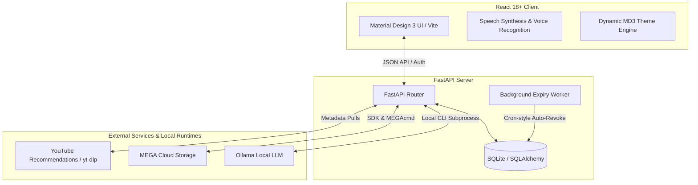

# 📚 Libraria 2.0 — Next-Generation Knowledge & Library Management System

Libraria 2.0 is a modern, full-stack, AI-powered knowledge management system. It combines an anime-styled landing page with feature-rich dashboards for **digital library management**, **smart document/note synchronization**, **healthcare workflows**, **real-time YouTube video recommendations**, and **community collaboration**.

The system leverages **local LLMs (via Ollama)** for AI assistant features (including natural language to SQL queries and automatic note summarization), integrates with **MEGA Cloud Storage** for secure document backup and streaming, and utilizes a **FastAPI backend** coupled with a **React 18+ TypeScript frontend** built on **Material Design 3 principles**.

---

## 📋 Table of Contents
- [Project Overview](#-project-overview)
- [Key Features](#-key-features)
  - [Digital Library & Ebook Circulation](#1-digital-library--ebook-circulation)
  - [Smart AI-Powered Notes](#2-smart-ai-powered-notes)
  - [Healthcare Management Module](#3-healthcare-management-module)
  - [Community & Collaboration Channels](#4-community--collaboration-channels)
  - [Custom UX/UI & Voice Accessibility](#5-custom-uxui--voice-accessibility)
- [Technology Stack](#-technology-stack)
- [Project Structure](#-project-structure)
- [Environment Configuration](#-environment-configuration)
- [Installation & Setup](#-installation--setup)
  - [Prerequisites](#prerequisites)
  - [Backend Setup](#1-backend-setup)
  - [Frontend Setup](#2-frontend-setup)
  - [Setting up Ollama for Local AI](#3-setting-up-ollama-for-local-ai)
- [Running the Application](#-running-the-application)
- [API Endpoints Reference](#-api-endpoints-reference)
- [Frontend Features & Architecture](#-frontend-features--architecture)
- [Backend Services & Architecture](#-backend-services--architecture)
- [Demo Accounts & Authentication](#-demo-accounts--authentication)
- [Production Builds & Deployment](#-production-builds--deployment)
- [License](#-license)

---

## 📖 Project Overview

Libraria 2.0 is built to streamline academic notes sharing, library book cataloging, and localized healthcare operations in a single application shell. By pairing a robust **FastAPI backend** with a **React 18 Single Page Application (SPA)**, Libraria 2.0 provides an interface that is both highly responsive and features advanced capabilities:
- **Local AI execution:** Running LLMs locally via Ollama means zero external API costs and absolute data privacy.
- **On-the-fly decryption streaming:** Secure document assets are stored in the cloud (MEGA) and fetched/decrypted streamingly via a backend proxy to bypass client-side authentication or CORS blocks.
- **Dynamic visual design:** Combining Material Design 3 guidelines with smooth CSS transition variables, users can seamlessly transition from standard dark/light modes to high-contrast AMOLED/OLED true black modes.

### System Architecture Overview



---

## 🌟 Key Features

### 1. Digital Library & Ebook Circulation
* **Catalog Management:** Create, read, update, and delete physical and digital books categorized by tags, genres, and subjects.
* **Temporary Ebook Issuance:** Issue digital books to users with specific lease terms (start and expiration date).
* **Automated Expiry Worker:** A FastAPI background daemon checks active ebook leases every 60 seconds and automatically revokes access to expired issues.
* **Wishlist & Requests:** Allow users to request new acquisitions, add books to personal wishlists, write book reviews, and upvote/downvote community feedback.
* **Popularity Index Engine:** A weighted caching mechanism computes popularity scores (based on views, reviews, borrow records, and active ebook issues) every 15 minutes.

### 2. Smart AI-Powered Notes
* **Natural Language to SQL Compiler:** Restricted to admin users, this translates conversational English queries (e.g., *"Find all notes related to Computer Science uploaded last week"*) into valid SQLite commands, validates them against SQL injection or harmful structures, runs them, and returns tabular results.
* **Smart Summarization:** Generate 2-3 sentence summaries of study notes automatically using the local model (`llama3:8b`).
* **Welcome Quote Engine:** Generates short, inspirational study quotes upon dashboard login.
* **Cloud-Synced Documents:** Notes are uploaded securely to **MEGA Cloud Storage** with streaming/decryption proxies, enabling PDFs to be decrypted and rendered on-the-fly in the browser.
* **Auto-Categorization:** Notes are automatically grouped under subjects, tags, and courses for seamless tracking.

### 3. Healthcare Management Module
* **Patient Operations:** Track patient profiles, parameters, and routines directly from the App Shell.
* **Appointments & Medical Records:** Schedule checks, assign appointments, and record treatment progress in a secure database structure.

### 4. Community & Collaboration Channels
* **Discussion Boards:** Create custom discussion channels, publish rich-text posts, and reply with comments.
* **Feedback Engine:** Upvote/downvote posts and comments, toggle likes, and report/flag inappropriate content for moderation.

### 5. Custom UX/UI & Voice Accessibility
* **Material Design 3 Theme System:** Pure dark mode, light mode, and system preference auto-detection. OLED/AMOLED true black options included.
* **Voice Capabilities:** Web Speech API integration allows for hands-free typing, voice commands, and speech-to-text notes.
* **Responsive Layout:** Adaptive sidebar and grids tailored for mobile, tablet, and desktop screens.

---

## 🛠️ Technology Stack

| Layer | Technologies & Libraries |
| :--- | :--- |
| **Frontend** | React 18, TypeScript, Vite, TailwindCSS, Framer Motion, React Router (v6), Chart.js, PDF.js, Three.js, Lucide Icons |
| **Backend** | Python 3.10+, FastAPI, SQLAlchemy ORM, Uvicorn, Pydantic v2, python-jose (JWT), Passlib (bcrypt) |
| **Database** | SQLite (development/production) |
| **Storage & Cloud** | MEGA.py (Python SDK), MEGAcmd CLI fallback (optimized for Windows file-locking) |
| **AI Runtimes** | Ollama Local Runtime (`llama3:8b`), local subprocess / fallback APIs |
| **Integrations** | `yt-dlp` (YouTube search & metadata extraction), Web Speech API (speech-to-text/synthesis) |

---

## 📁 Project Structure

```
Libraria 2.0/
├── backend/                    # Python FastAPI Backend
│   ├── app/
│   │   ├── core/               # App configuration, security helpers, database connection
│   │   │   ├── config.py       # Pydantic BaseSettings load configuration
│   │   │   ├── custom_types.py # Custom DB types
│   │   │   ├── database.py     # SQLAlchemy Engine & SessionLocal setup
│   │   │   └── security.py     # Password hashing & JWT token creation
│   │   ├── crud/               # CRUD db queries (books, notes, community, borrows, etc.)
│   │   ├── models/             # SQLAlchemy DB Models (book, user, borrow, community, etc.)
│   │   ├── routes/             # FastAPI controllers / api endpoints
│   │   ├── schemas/            # Pydantic schemas for request/response validation
│   │   └── utils/              # Helper utilities
│   ├── uploads/                # Local uploads folder
│   ├── main.py                 # FastAPI application entrypoint & background expiry daemon
│   ├── requirements.txt        # Python backend dependencies
│   └── reset_db.py             # Script to flush SQLite database & populate demo data
├── frontend/                   # React Frontend
│   ├── src/
│   │   ├── components/         # Reusable UI widgets (Layouts, sidebar, modals, forms)
│   │   ├── config/             # Environment URLs, constants
│   │   ├── contexts/           # Global states (ThemeContext, AuthContext)
│   │   ├── hooks/              # Voice search, Web Speech API integration, storage hooks
│   │   ├── modules/            # Domain-driven features
│   │   │   ├── healthcare/     # Patient tracking, medical records, appointments views
│   │   │   ├── library/        # Books catalog, issued ebooks, wishlist, request views
│   │   │   ├── notes/          # Notes view, PDF viewer, AI tools (SQL compiler)
│   │   │   └── settings/       # Account preference adjustments & dark/AMOLED theme configuration
│   │   ├── pages/              # View wrappers (Landing, Login, Dashboards)
│   │   ├── services/           # Axios HTTP request services (api client)
│   │   ├── types/              # TypeScript interface & type definitions
│   │   ├── index.css           # Core styling, variables, theme overrides
│   │   └── main.tsx            # Vite root mounting file
│   ├── package.json            # Node scripts and dev dependencies
│   └── vite.config.ts          # Vite build config
└── readme.md                   # Project documentation
```

---

## ⚙️ Environment Configuration

Create a `.env` file in the `backend/` directory to store credentials:

```env
# Server settings
DATABASE_URL="sqlite:///./libraria.db"

# MEGA Cloud Storage configuration
MEGA_EMAIL="your_mega_email@example.com"
MEGA_PASSWORD="your_mega_password"

# Local AI settings
OLLAMA_CLI_MODEL="llama3:8b"

# JWT Auth security (optional, default is generated randomly on startup if missing)
SECRET_KEY="your_custom_long_jwt_secret_key"
ALGORITHM="HS256"
```

---

## 🚀 Installation & Setup

### Prerequisites
* **Node.js** 18+ and **npm**
* **Python** 3.10+
* **Ollama** installed locally (optional, for AI features)

---

### 1. Backend Setup

1. **Navigate to backend:**
   ```bash
   cd backend
   ```

2. **Create a virtual environment & activate it:**
   ```bash
   # Windows (PowerShell/CMD)
   python -m venv venv
   .\venv\Scripts\activate

   # macOS/Linux
   python3 -m venv venv
   source venv/bin/activate
   ```

3. **Install dependencies:**
   ```bash
   pip install -r requirements.txt
   ```

4. **Initialize/Populate the SQLite Database:**
   ```bash
   # Generates schema and populates preset demo accounts, books, and notes
   python reset_db.py
   ```

5. **Start the server:**
   ```bash
   python main.py
   ```
   * The server runs at `http://localhost:8000`
   * Interactive API documentation (Swagger UI) is available at `http://localhost:8000/docs`

---

### 2. Frontend Setup

1. **Navigate to frontend:**
   ```bash
   cd ../frontend
   ```

2. **Install dependencies:**
   ```bash
   npm install
   ```

3. **Run the local development server:**
   ```bash
   npm run dev
   ```
   * The app will start at `http://localhost:5173`

---

### 3. Setting up Ollama for Local AI

1. Download and install Ollama from [ollama.com](https://ollama.com).
2. Start the Ollama background service on your system.
3. Download the default Llama model:
   ```bash
   ollama pull llama3:8b
   ```
   *(If the model is missing, the backend is designed to run `ollama pull` automatically to resolve the dependency during AI endpoint execution.)*

---

## 🏃 Running the Application

To run the application locally, ensure you have both the backend and frontend running simultaneously:

- **Backend:** `cd backend && .\venv\Scripts\activate && python main.py`
- **Frontend:** `cd frontend && npm run dev`

---

## 🔌 API Endpoints Reference

### 🔐 Authentication (`/api/auth`)
* `POST /api/auth/register` — Register a new user.
* `POST /api/auth/login` — Sign in and obtain a JWT token.
* `GET /api/auth/me` — Retrieve the current logged-in user profile.

### 📚 Book Catalog (`/api/books`)
* `GET /api/books` — Get all books in the catalog.
* `GET /api/books/{book_id}` — Get details of a specific book.
* `POST /api/books` — Add a new book (Admin only).
* `PUT /api/books/{book_id}` — Update book metadata (Admin only).
* `DELETE /api/books/{book_id}` — Remove a book (Admin only).
* `POST /api/books/upload-ebook` — Upload an e-book file to MEGA storage (Admin only).
* `GET /api/books/proxy-mega` — Proxies MEGA-hosted ebooks for rendering.
* `GET /api/books/popularity/all` — Fetch cached book popularity scores.
* `GET /api/books/{book_id}/popularity` — Get popularity score for a specific book.

### 📄 Ebook Issuance (`/api/ebook_issues`)
* `GET /api/ebook_issues` — List all issued ebook logs (Admin only).
* `GET /api/ebook_issues/user/{user_id}` — List ebook issues belonging to a specific user.
* `POST /api/ebook_issues/issue` — Issue an ebook to a user for a set time window.
* `POST /api/ebook_issues/revoke/{issue_id}` — Terminate an active issue immediately.

### 🧠 Notes & Local AI (`/api/notes`)
* `GET /api/notes` — Get a list of notes.
* `POST /api/notes/ai/query` — Translate NL to SQL and execute (Admin only).
* `POST /api/notes/ai/summarize` — Generates note summary using Ollama.
* `GET /api/notes/ai/welcome` — Generates motivational quote using Ollama.
* `GET /api/notes/ai/logs` — Retrieves notes AI logs (Admin only).

### 👥 Community Discussion (`/api/community`)
* `POST /api/community/posts` — Publish a new discussion post (Admin only).
* `GET /api/community/posts` — Get all community posts (with comment & upvote counts).
* `GET /api/community/posts/{post_id}` — Get single post details.
* `DELETE /api/community/posts/{post_id}` — Delete a post (Admin only).
* `POST /api/community/comments` — Post a comment on a discussion.
* `DELETE /api/community/comments/{comment_id}` — Delete a comment (Owner/Admin).
* `POST /api/community/likes/toggle` — Like/unlike a post.
* `POST /api/community/comments/{comment_id}/like` — Toggle comment like.
* `POST /api/community/comments/{comment_id}/dislike` — Toggle comment dislike.
* `POST /api/community/comments/{comment_id}/report` — Flag/Report comment.

### 🎥 YouTube Recommendations (`/api/youtube-recommendations`)
* `GET /api/youtube-recommendations/videos` — Personal recommendations fetched from YouTube based on the user's note-taking and book activity.
* `GET /api/youtube-recommendations/user-activity` — Return detailed analytics regarding note accesses, active reviews, and preferred subjects.

---

## 🎨 Frontend Features & Architecture

The frontend is an application built with React 18+ and TypeScript, organized using a modular, domain-driven structure:

1. **Dashboard Controllers:**
   - [DashboardController.tsx](file:///c:/Users/Amarjeet%20Singh/Documents/GitHub/Libraria%202.0/frontend/src/pages/DashboardController.tsx) routes the user based on role: [UserDashboard.tsx](file:///c:/Users/Amarjeet%20Singh/Documents/GitHub/Libraria%202.0/frontend/src/pages/UserDashboard.tsx) for general student views and [AdminDashboard.tsx](file:///c:/Users/Amarjeet%20Singh/Documents/GitHub/Libraria%202.0/frontend/src/pages/AdminDashboard.tsx) / [AdminDashboardNew.tsx](file:///c:/Users/Amarjeet%20Singh/Documents/GitHub/Libraria%202.0/frontend/src/pages/AdminDashboardNew.tsx) for manager actions.
2. **Global States & Contexts:**
   - **Theme Engine:** `ThemeProvider` manages theme tokens, configuring light mode, dark mode, and true black AMOLED preferences dynamically by modifying class names on the document root.
   - **Auth Session:** `AuthProvider` stores JWT in localStorage, validates user properties, and exports active user details to route guards.
3. **Domain Modules:**
   - **Library:** Handles books list, catalog addition modals, temporary issues tracking, reviews rating forms, and wishlist views.
   - **Notes:** Features a custom PDF viewer that loads streamable note PDFs via the proxy, alongside an interactive AI module where admins run text-to-SQL commands.
   - **Healthcare:** Tracks patient logs, scheduling widgets, and historical medicine records in a clean patient tracker.
4. **Voice Hooks:**
   - Implements speech-to-text capabilities inside textareas and prompts using standard `SpeechRecognition` hooks.

---

## 🧠 Backend Services & Architecture

The FastAPI backend manages long-lived operations, database state, and local process isolation:

1. **Ebook Expiry Worker:**
   - Initiated on FastAPI application startup, this running asyncio task queries active `EbookIssue` entries every 60 seconds and updates status fields to `'revoked'` if the `expiry_date` has elapsed.
2. **Local LLM Execution:**
   - Communicates with Ollama over standard HTTP loopbacks if `LLAMA_API_URL` is set, or executes direct subprocess command pipelines (`ollama run llama3:8b`) to prevent blocking thread execution.
3. **MEGA Cloud Integration:**
   - Configures connection to MEGA via `mega.py` and proxies document streaming blocks chunk-by-chunk using `StreamingResponse`, enabling seamless browser PDF rendering without exposing user login tokens.
4. **Real-time YouTube Recommendation Service:**
   - Evaluates a user's recent interactions (downloads, reviews, clicks) to find dominant interest subjects.
   - Leverages `yt-dlp` in real-time to query YouTube for matching academic terms, formats the videos, calculates popularity, and returns customized video cards.

---

## 🔐 Demo Accounts & Authentication

For ease of testing, the system provides pre-configured credentials:

* **Administrator Account:**
  * **Email:** `admin@example.com`
  * **Password:** `demo123`
* **Regular User Account:**
  * **Email:** `user@example.com`
  * **Password:** `demo123`

---

## 📦 Production Builds & Deployment

### Build Frontend
To compile the frontend React code into optimized assets ready for hosting:
```bash
cd frontend
npm run build
```
This generates build files inside `frontend/dist/`.

### Run Backend in Production
For production environments, run the application using `uvicorn` with multiple workers behind a reverse proxy (e.g. Nginx):
```bash
cd backend
uvicorn app.main:app --host 0.0.0.0 --port 8000 --workers 4
```

---

## 📄 License

This project is licensed under the MIT License. See individual files for copyright details.
